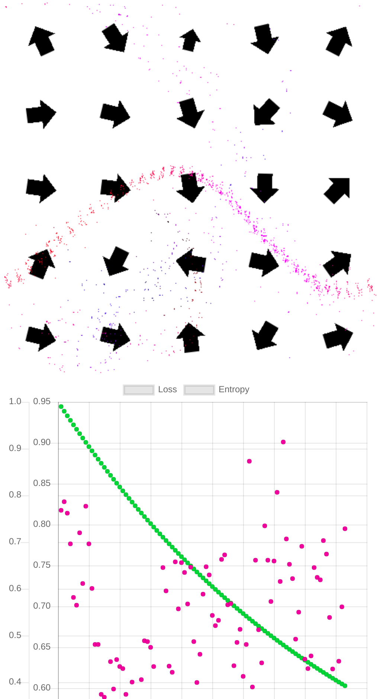

# Force Field Art

## Introduction 
Inspired by advances in machine learning training running on the GPU in a browser. I've become motivated to build art and demo applications of machine learning to explore the field and help pass on what I learn to others. This demo is a force field which moves particles around that is trained based on different evaluation particles of function position. The goal is to create emergent art by giving the system sets of constraints and seeing what it comes up with.

# Current State
Currently it optimizes for getting all particles near the middle. With the current settings in the repo the network converges on a strong solutions around 50% of the time. Able to achieve 0 or near zero loss.

# Current Work
Researching and implements more advanced DFO solutions.

# Development

Setup dependencies with
```
yarn install
```

To build live and interactive run 

```
yarn run start:dev
```

To build the dev build to `dist` run:
```
yarn run build:dev
```

Deploy by pushing dist folder to gh-pages

NOTE:

There is currently no production build setup.

# Example Photo


